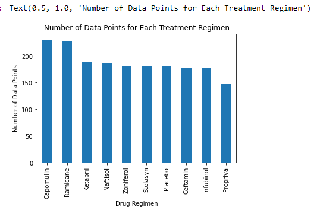
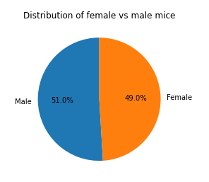
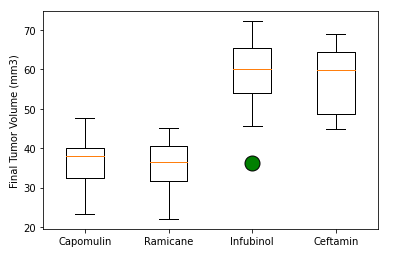
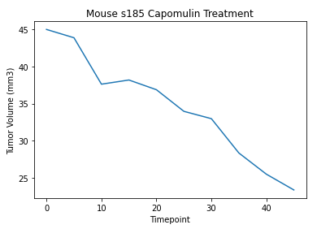
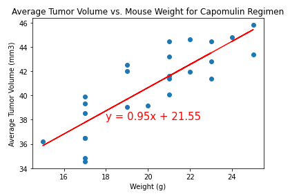

# matplotlib-pymaceuticals

In this study, 249 mice identified with SCC tumor growth were treated through a variety of drug regimens. Over the course of 45 days, tumor development was observed and measured. The purpose of this study was to compare the performance of Pymaceuticals' drug of interest, Capomulin, versus the other treatment regimens. The () contain the data from the study used in my analysis.

The [Pymaceuticals](./pymatceuticals.ipynb) notebook contains tables and figures needed for the technical report of the study including a top-level summary of the study results. Below is what is included in this summary:

## Data Analysis

* Reading in the CSV's, merging the two datasets into one dataframe, and cleaning the data by removing duplicates.
* Generating summary statistics such as mean tumor volume, median tumor volume, variance in tumor volume, standard deviation in tumor volume, and SEM by each drug regimen.

## Plotting

The notebook also contains the following charts: 

### Bar Chart

A bar chart showing the total number of measurements taken on each drug regimen.

### Pie Chart

A pie chart showing the distribution of female versus male mice.

### Box Plot

A box plot of the final tumor volume of each mouse across four regimens of interest.

### Line Chart

A line plot of tumor volume vs. time point for a mouse treated with Capomulin.

### Scatter Plot

A Scatter plot for the mouse weight and average tumor volume for the Capomulin regimen with a linear regression line.

## Observations and insights

Based on the above analysis, the below observations can be made about the study:

* There is a positive correlation betwenn mouse weight and average tumor volume.
* Infubinol is the only drug to have a potential outlier.
* Mouse s185's average tumor volume has a negative correlation to timepoint.
